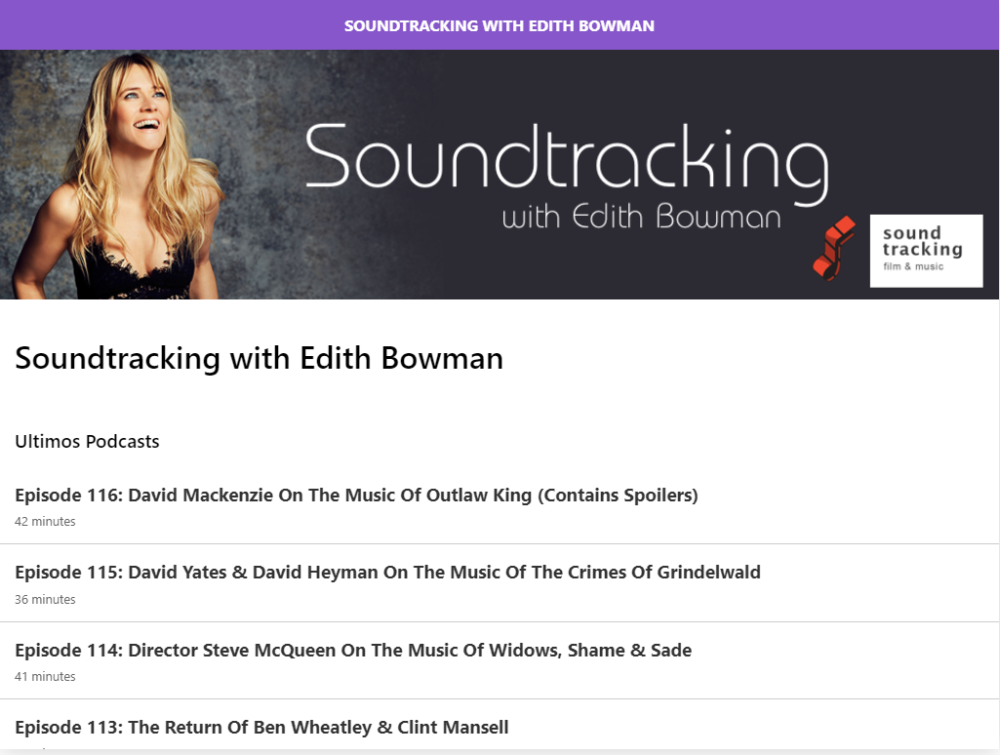

# Vio---podcast

Podcasts app

## Requirements
- Node.JS
- NextJS
- NPM or Yarn
- Basic knowledge in ES6 (JavaScript)
- API documentation from https://api.audioboom.com
- >>>[check it out](https://next-ipi4tqwno.now.sh)<<<

 

# Get started

## Clone the repository to your machine

You can use git or download it directly from github

## Get the dependencies
Open your cloned folder. Then, using your favorite package manager get the dependencies.

Example using npm

`npm install`

Example using yarn

`yarn`

## Start development server & build

Open your cloned folder. Then, using your favorite package manager run `dev` command.

Example using npm

`npm run dev`

Example using yarn

`yarn dev`

When you done these steps, your default browser should open and redirect you to `localhost:3000`

## Building for production

Example using npm

`npm run build && npm start`

Example using yarn

`yarn build && start`

## License

MIT
